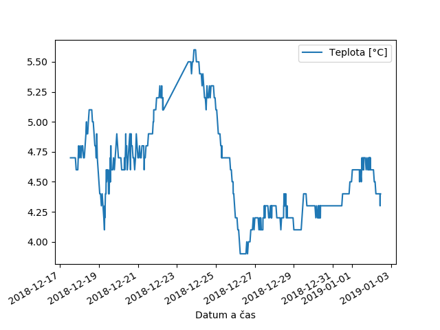

# Scraper for Water Levels and Temperatures at chmi.cz

Suitable for http://hydro.chmi.cz/hpps/* (as of beginning 2019).

Example output:



```
2018-12-17 13:00:00,46,52.1,4.7
2018-12-17 14:00:00,46,52.1,4.7
2018-12-17 15:00:00,46,52.1,4.7
2018-12-17 16:00:00,46,52.1,4.7
2018-12-17 17:00:00,47,55.1,4.7
2018-12-17 18:00:00,47,55.1,4.7
2018-12-17 19:00:00,46,52.1,4.7
```

# Installation

    conda env create -f conda.yml
    
# Usage

    conda activate chmi
    python scraper.py
    
# Cronjob

Edit paths in the `crontab`. Set an user crontab to regularly scrape the data:

    crontab crontab
